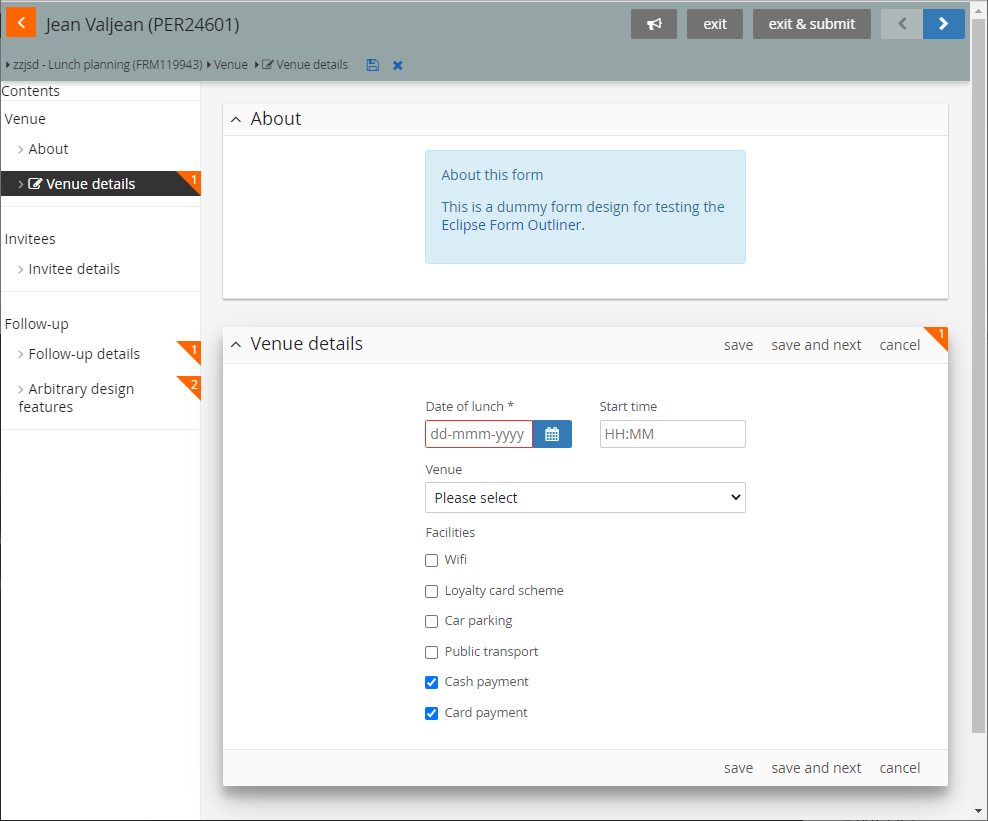
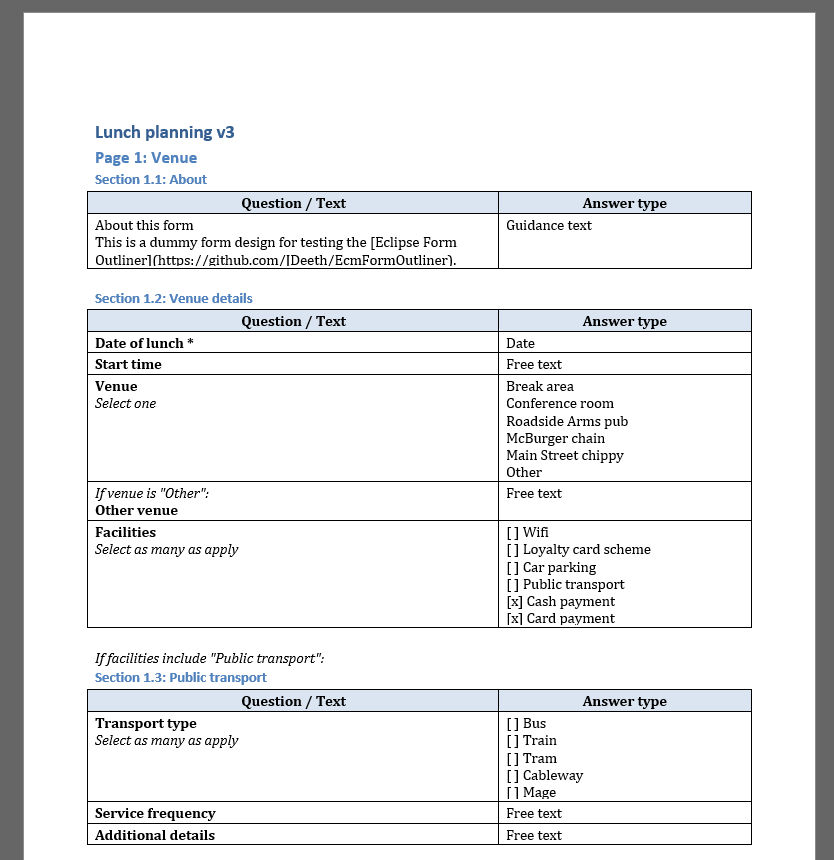

# ECM Form Outliner

---

This is (/will become) an app for parsing OLM ECLIPSE Case Management form designs into a simplified outline, presented in a Word document.

_Form as viewed by user_


_Example output_


This is to facilitate informed discussion about form contents and behaviour which is hard to communicate with screenshots alone - particularly contents of drop-down lists and behaviour of conditionally hidden sections/questions.

## Status

Under development, not yet functional.

## Development

```shell
git clone https://github.com/JDeeth/EcmFormOutliner
cd EcmFormOutliner
py -m venv venv
venv/Scripts/activate
pip install .[dev]
```

To run tests:

```bash
pytest .
pylint .
```